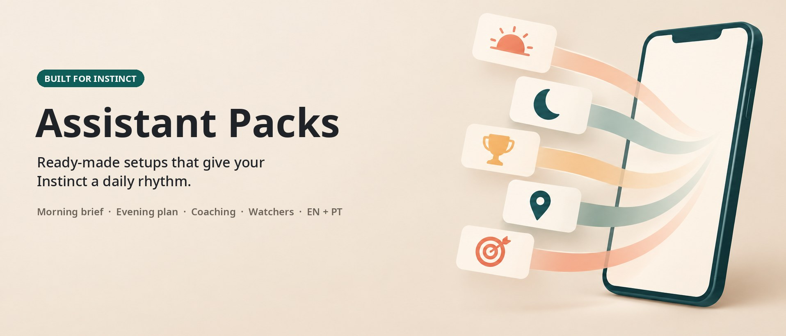

<p align="center">
  
</p>

<p align="center">
  <a href="https://instinct.com"></a>
  <a href="#-the-packs"></a>
  
  <a href="LICENSE"></a>
  <a href="https://github.com/olserra/assistant-packs/stargazers"></a>
  <a href="CONTRIBUTING.md"></a>
  <br>
  <a href="https://github.com/olserra/assistant-packs/issues?q=is%3Aissue+is%3Aopen+label%3A%22good+first+issue%22"></a>
  <a href="#-contributors"></a>
  <a href="https://github.com/olserra/assistant-packs/discussions"></a>
  <a href="CODE_OF_CONDUCT.md"></a>
  <a href="CHANGELOG.md"></a>
</p>

<p align="center">
  <b>English</b> · <a href="README.pt.md">Português</a> ·
  <a href="#-install-in-60-seconds">Install</a> ·
  <a href="#-the-packs">Packs</a> ·
  <a href="#-roadmap">Roadmap</a> ·
  <a href="https://github.com/olserra/assistant-packs/issues/new?template=pack-request.yml">Request a pack</a> ·
  <a href="CONTRIBUTING.md">Contribute</a> ·
  <a href="docs/pack-authoring.md">Docs</a> ·
  <a href="https://github.com/olserra/assistant-packs/discussions">Discussions</a>
</p>

<p align="center"><sub>Created by <a href="https://github.com/olserra">@olserra</a> · built in the open by everyone who uses it</sub></p>

---

**Instinct gets much better once it is configured.** The catch: getting a morning brief that actually helps, an evening plan for tomorrow, one nudge a day that you don't learn to ignore, watchers that warn you before you are late - that takes days of back-and-forth.

**A pack is that setup, written down once.** Send one message to your Instinct, answer a few questions, and it starts running your day. Your details stay in your Instinct. The pack itself is plain Markdown with zero personal data.

## 👀 What it looks like in your chat

<table>
  <tr>
    <td align="center" width="50%"><br><sub><b>☀️ 07:00 · Morning brief</b><br>Weather, your numbers, headlines, 3 priorities, a 5-min drill, your streak</sub></td>
    <td align="center" width="50%"><br><sub><b>🌙 21:00 · Evening brief</b><br>Tomorrow's agenda, what to prepare tonight, a 2-minute reflection</sub></td>
  </tr>
  <tr>
    <td align="center"><br><sub><b>⏰ 13:00 · Coaching ping</b><br>One question a day. No follow-ups. A smaller version on hard days.</sub></td>
    <td align="center"><br><sub><b>🏆 Sunday · Scoreboard</b><br>Max 4 points a day. Shows what you did, never a "missed" list.</sub></td>
  </tr>
</table>

<sub>Examples with illustrative values. Your briefs use your city, your calendar and live sources.</sub>

## ⚡ Install in 60 seconds

**1. Copy this and send it to your Instinct** (iMessage, WhatsApp, Slack - wherever you already talk to it):

```text
Install the "Configured Assistant" pack from Assistant Packs.
Instructions: https://raw.githubusercontent.com/olserra/assistant-packs/main/packs/configured-assistant/skills/configured-assistant/SKILL.md
Modules are in the references/ folder next to it.
Run the setup interview with me, schedule only the routines I approve,
and show me a sample evening brief for tomorrow before the first one goes out.
```

**2. Answer the setup questions.** City, brief times, the numbers and news you care about, one skill to practice. Say "defaults" to go fast.

**3. Check the sample, then let it run.** Change anything later in plain words: *"move the morning brief to 6:30"*, *"drop the markets"*, *"pause everything this week"*.

**4. 👍 [issue #1](https://github.com/olserra/assistant-packs/issues/1)** if it works for you. That thumbs-up is the public install counter.

> [!TIP]
> Want just one piece? Send *"Install only the morning brief module from the Configured Assistant pack"* with the same link. More install options in the pack's [INSTALL.md](packs/configured-assistant/INSTALL.md).

## 📦 The packs

| # | Pack | What your Instinct does | Languages | Status |
|:-:|------|--------------------------|:---------:|:------:|
| 1 | **[The Configured Assistant](packs/configured-assistant/)** | Morning brief · evening brief for tomorrow · one daily coaching ping · points and a Sunday scoreboard · traffic and reply watchers · weekly habit technique | 🇬🇧 🇵🇹 | ✅ **Live · free** |
| 2 | **[Inbox Zero Chief](packs/inbox-zero-chief/)** | Triage rules, reply drafts in your voice, a weekly unsubscribe sweep | 🇬🇧 | 🛠️ **Scaffolded · [help wanted](https://github.com/olserra/assistant-packs/issues/2)** |
| 3 | **[Market Watch](packs/market-watch/)** | A market brief before the open (indices, currencies, crypto, headlines) · price and move alerts you set · a weekly wrap. Facts, never advice | 🇬🇧 🇵🇹 | ✅ **Live · free** |
| 4 | Family Logistics | Shared calendars, school deadlines, pickups, birthdays and gifts | - | 🗳️ [Vote](https://github.com/olserra/assistant-packs/issues/3) |
| 5 | Job Search Copilot | Pipeline tracking, interview prep briefs, follow-up nudges | - | 🗳️ [Vote](https://github.com/olserra/assistant-packs/issues/4) |

Missing the one you need? **[Request a pack](https://github.com/olserra/assistant-packs/issues/new?template=pack-request.yml)** and 👍 the [requests you want most](https://github.com/olserra/assistant-packs/issues?q=is%3Aissue+is%3Aopen+label%3Apack-request+sort%3Areactions-%2B1-desc). The most-voted request is the next pack we build.

## 🧭 How packs behave

| | |
|---|---|
| 🔒 **Zero personal data** | Packs are templates. Your city, hours and interests are asked at install and stay in your Instinct. |
| 🙋 **Asks before acting for you** | A pack never messages people, books, buys or accepts invites on its own. |
| 🌱 **Adapts, doesn't nag** | Hard day? The plan shrinks and a walk counts. No second pings, no guilt. |
| 📱 **Phone-sized** | Every message reads in under a minute. |
| 🧩 **Small pieces** | Every module works alone. Take the whole pack or just the morning brief. |
| 🔎 **Checked, not remembered** | Weather, prices and news come from live sources when the message is sent. |

## 🗺️ Roadmap

- [x] Pack #1 · The Configured Assistant (EN + PT)
- [x] Public request board with votes
- [x] Live install counter (👍 on issue #1)
- [x] Contributor guides, templates and good first issues
- [x] Pack #3 · Market Watch (EN + PT)
- [ ] Pack #2 · Inbox Zero Chief, built by the community ([help wanted](https://github.com/olserra/assistant-packs/issues/2))
- [ ] Pack #4 · picked by the most-voted [request](https://github.com/olserra/assistant-packs/issues?q=is%3Aissue+is%3Aopen+label%3Apack-request+sort%3Areactions-%2B1-desc)
- [ ] Pack pages with community tips ("how I tuned my morning brief")
- [ ] Contributor badges: first fix, first module, pack author
- [ ] More languages (ES, FR) - [help translate](https://github.com/olserra/assistant-packs/issues?q=is%3Aissue+is%3Aopen+label%3Atranslation)

## 🤝 Build it with us

This project belongs to the people who use it. We decide together what gets built, and every contribution is credited.

- **🌱 [Your first contribution in 15 minutes](CONTRIBUTING.md#-your-first-contribution-in-15-minutes)** - no coding, all in the browser.
- **🗳️ [Vote on the board](https://github.com/olserra/assistant-packs/issues?q=is%3Aissue+is%3Aopen+label%3Apack-request+sort%3Areactions-%2B1-desc)** - 👍 decides what gets built next. **[Request a pack](https://github.com/olserra/assistant-packs/issues/new?template=pack-request.yml)** if yours is missing.
- **💬 [Discussions](https://github.com/olserra/assistant-packs/discussions)** - ask in Q&A, share ideas, show how you tuned a pack in Show & Tell.
- **✍️ [Pack-authoring guide](docs/pack-authoring.md)** - how we design packs, the privacy rules and the quality bar. Translating? See the [translation guide](docs/translating.md).
- **⭐ Star the repo** to follow new packs.

### 🌱 Good first issues

| Task | Time | Skills |
|------|:----:|--------|
| [Translate the morning brief module to Spanish](https://github.com/olserra/assistant-packs/issues/5) | ~30 min | Spanish |
| [Translate the evening brief module to French](https://github.com/olserra/assistant-packs/issues/6) | ~30 min | French |
| [Add a weekend variant of the morning brief](https://github.com/olserra/assistant-packs/issues/7) | ~45 min | Writing |
| [Add a preview card for the watchers module](https://github.com/olserra/assistant-packs/issues/8) | ~45 min | SVG text editing |
| [Pack #2: write the weekly unsubscribe sweep module](https://github.com/olserra/assistant-packs/issues/9) | ~45 min | Writing |

[All good first issues →](https://github.com/olserra/assistant-packs/issues?q=is%3Aissue+is%3Aopen+label%3A%22good+first+issue%22)

### 🙌 Contributors

Thanks to everyone who builds Assistant Packs ([emoji key](https://allcontributors.org/en/reference/emoji-key/)). Translations, ideas, reviews and docs count, not only packs.

<!-- ALL-CONTRIBUTORS-LIST:START - Do not remove or modify this section -->
<!-- prettier-ignore-start -->
<!-- markdownlint-disable -->
<table>
  <tbody>
    <tr>
      <td align="center" valign="top" width="14.28%"><a href="https://github.com/olserra"><br /><sub><b>olserra</b></sub></a><br /><sub>creator</sub><br />🖋 🤔 📖 🎨 🚧</td>
      <td align="center" valign="top" width="14.28%"><a href="CONTRIBUTING.md#-your-first-contribution-in-15-minutes"><br /><sub><b>You?</b></sub></a><br /><sub>start here</sub></td>
    </tr>
  </tbody>
</table>
<!-- markdownlint-restore -->
<!-- prettier-ignore-end -->
<!-- ALL-CONTRIBUTORS-LIST:END -->

<a href="https://github.com/olserra/assistant-packs/graphs/contributors"></a>

## ❓ FAQ

<details>
<summary><b>Is this an official Instinct project?</b></summary>

No. Assistant Packs is an independent community project built by Instinct users. It is not affiliated with or endorsed by Instinct.
</details>

<details>
<summary><b>Does a pack read my email or calendar?</b></summary>

Only if you say yes during setup. The evening brief and the watchers work better with calendar and email access; everything else works without it.
</details>

<details>
<summary><b>What does it cost?</b></summary>

Packs are free and MIT-licensed.
</details>

<details>
<summary><b>I don't use Instinct. Can I still use a pack?</b></summary>

Packs are written for Instinct first. The files follow the open <a href="https://agentskills.io/specification">Agent Skills</a> format, so other assistants can read them too. See <a href="ADAPTERS.md">ADAPTERS.md</a>.
</details>

## 📁 Repository layout

```text
packs/<pack-id>/
  README.md · README.pt.md   what the pack does, with previews
  INSTALL.md                 copy-paste install messages for Instinct
  pack.yaml                  name, version, modules, credits
  skills/<pack-id>/          English skill: SKILL.md + references/ (one file per module)
  skills/<pack-id>-pt/       Portuguese skill
assets/                      banner and preview images
docs/                        pack-authoring and translation guides (EN + PT)
examples/                    gallery of previews and tuning recipes
FORMAT.md                    the pack format
CHANGELOG.md                 what changed, per release
```

## License

[MIT](LICENSE) · Created by [@olserra](https://github.com/olserra), built with [our contributors](CONTRIBUTORS.md) · [Code of Conduct](CODE_OF_CONDUCT.md) · [Security & privacy](SECURITY.md) · Not affiliated with Instinct.
