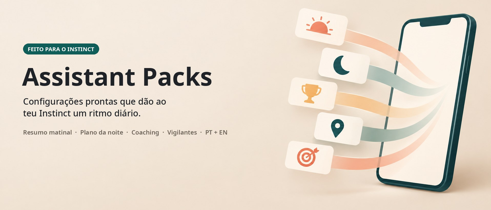

<p align="center">
  
</p>

<p align="center">
  <a href="https://instinct.com"></a>
  <a href="#-os-packs"></a>
  
  <a href="LICENSE"></a>
  <a href="https://github.com/olserra/assistant-packs/stargazers"></a>
  <a href="CONTRIBUTING.md"></a>
</p>

<p align="center">
  <a href="README.md">English</a> · <b>Português</b> ·
  <a href="#-instalar-em-60-segundos">Instalar</a> ·
  <a href="#-os-packs">Packs</a> ·
  <a href="#-roadmap">Roadmap</a> ·
  <a href="https://github.com/olserra/assistant-packs/issues/new?template=pack-request.yml">Pedir um pack</a> ·
  <a href="CONTRIBUTING.md">Contribuir</a>
</p>

---

**O Instinct fica muito melhor depois de configurado.** O problema: chegar a um resumo matinal que ajuda mesmo, a um plano da noite para amanhã, a um lembrete por dia que não aprendes a ignorar, a vigilantes que te avisam antes de chegares atrasado - isso leva dias de ida e volta.

**Um pack é essa configuração, escrita uma vez.** Envias uma mensagem ao teu Instinct, respondes a algumas perguntas e ele passa a gerir o teu dia. Os teus dados ficam no teu Instinct. O pack é Markdown simples, sem dados pessoais.

## 👀 Como fica no teu chat

<table>
  <tr>
    <td align="center" width="50%"><br><sub><b>☀️ 07:00 · Resumo matinal</b><br>Tempo, os teus números, manchetes, 3 prioridades, exercício de 5 min, sequência</sub></td>
    <td align="center" width="50%"><br><sub><b>🌙 21:00 · Resumo da noite</b><br>Agenda de amanhã, o que preparar hoje, reflexão de 2 minutos</sub></td>
  </tr>
  <tr>
    <td align="center"><br><sub><b>⏰ 13:00 · Lembrete de coaching</b><br>Uma pergunta por dia. Sem insistir. Versão mais curta nos dias difíceis.</sub></td>
    <td align="center"><br><sub><b>🏆 Domingo · Placar</b><br>Máximo 4 pontos por dia. Mostra o que fizeste, nunca uma lista de falhas.</sub></td>
  </tr>
</table>

<sub>Exemplos com valores ilustrativos. Os teus resumos usam a tua cidade, o teu calendário e fontes ao vivo.</sub>

## ⚡ Instalar em 60 segundos

**1. Copia isto e envia ao teu Instinct** (iMessage, WhatsApp, Slack - onde já falas com ele):

```text
Instala o pack "Assistente Configurado" do Assistant Packs.
Instruções: https://raw.githubusercontent.com/olserra/assistant-packs/main/packs/configured-assistant/skills/configured-assistant-pt/SKILL.md
Os módulos estão na pasta references/ ao lado.
Faz a entrevista de configuração comigo, agenda só as rotinas que eu aprovar
e mostra-me um exemplo do resumo da noite de amanhã antes do primeiro sair.
```

**2. Responde às perguntas.** Cidade, horas dos resumos, os números e notícias que te interessam, uma habilidade para treinar. Diz "padrão" para ir mais rápido.

**3. Vê o exemplo e deixa correr.** Muda o que quiseres mais tarde, por palavras tuas: *"passa o resumo matinal para as 6:30"*, *"tira os mercados"*, *"pausa tudo esta semana"*.

**4. 👍 na [issue #1](https://github.com/olserra/assistant-packs/issues/1)** se funcionar para ti. Esse polegar é o contador público de instalações.

> [!TIP]
> Só queres uma parte? Envia *"Instala só o módulo do resumo matinal do pack Assistente Configurado"* com o mesmo link. Mais opções no [INSTALL.md](packs/configured-assistant/INSTALL.md) do pack.

## 📦 Os packs

| # | Pack | O que o teu Instinct faz | Línguas | Estado |
|:-:|------|--------------------------|:-------:|:------:|
| 1 | **[O Assistente Configurado](packs/configured-assistant/README.pt.md)** | Resumo matinal · resumo da noite para amanhã · um lembrete de coaching por dia · pontos e placar ao domingo · vigilantes de trânsito e respostas · técnica de hábitos da semana | 🇵🇹 🇬🇧 | ✅ **Disponível · grátis** |
| 2 | Chefe da Caixa de Entrada | Regras de triagem, rascunhos no teu tom, limpeza semanal de subscrições | - | 🗳️ [Votar](https://github.com/olserra/assistant-packs/issues?q=is%3Aissue+label%3Apack-request) |
| 3 | Logística Familiar | Calendários partilhados, prazos da escola, recolhas, aniversários e presentes | - | 🗳️ [Votar](https://github.com/olserra/assistant-packs/issues?q=is%3Aissue+label%3Apack-request) |
| 4 | Copiloto de Procura de Emprego | Pipeline de candidaturas, briefings de entrevista, lembretes de follow-up | - | 🗳️ [Votar](https://github.com/olserra/assistant-packs/issues?q=is%3Aissue+label%3Apack-request) |

Falta o pack de que precisas? **[Pede um pack](https://github.com/olserra/assistant-packs/issues/new?template=pack-request.yml)** e dá 👍 aos [pedidos que mais queres](https://github.com/olserra/assistant-packs/issues?q=is%3Aissue+is%3Aopen+label%3Apack-request+sort%3Areactions-%2B1-desc). O pedido mais votado é o próximo pack a ser construído.

## 🧭 Como os packs se comportam

| | |
|---|---|
| 🔒 **Zero dados pessoais** | Os packs são modelos. A tua cidade, horários e interesses são pedidos na instalação e ficam no teu Instinct. |
| 🙋 **Pergunta antes de agir por ti** | Um pack nunca envia mensagens a outras pessoas, reserva, compra ou aceita convites sozinho. |
| 🌱 **Adapta-se, não chateia** | Dia difícil? O plano encolhe e uma caminhada conta. Sem segundo lembrete, sem culpa. |
| 📱 **Tamanho telemóvel** | Cada mensagem lê-se em menos de um minuto. |
| 🧩 **Peças pequenas** | Cada módulo funciona sozinho. Leva o pack todo ou só o resumo matinal. |
| 🔎 **Verificado, não memorizado** | Tempo, preços e notícias vêm de fontes ao vivo no momento do envio. |

## 🗺️ Roadmap

- [x] Pack n.º 1 · O Assistente Configurado (PT + EN)
- [x] Quadro público de pedidos com votos
- [x] Contador de instalações ao vivo (👍 na issue #1)
- [ ] Pack n.º 2 · escolhido pelo [pedido](https://github.com/olserra/assistant-packs/issues?q=is%3Aissue+is%3Aopen+label%3Apack-request+sort%3Areactions-%2B1-desc) mais votado
- [ ] Páginas de pack com dicas da comunidade ("como afinei o meu resumo matinal")
- [ ] Distintivos de contribuidor: primeira correção, primeiro módulo, autor de pack
- [ ] Mais línguas (ES, FR) - [ajuda a traduzir](CONTRIBUTING.md)

## 🤝 Comunidade

- **💡 [Pede um pack](https://github.com/olserra/assistant-packs/issues/new?template=pack-request.yml)** - descreve a rotina que gostavas que o teu Instinct fizesse.
- **🗳️ [Vota no quadro](https://github.com/olserra/assistant-packs/issues?q=is%3Aissue+is%3Aopen+label%3Apack-request+sort%3Areactions-%2B1-desc)** - os 👍 decidem o que se constrói a seguir.
- **🛠️ [Contribui](CONTRIBUTING.md)** - melhora um módulo, traduz um pack ou publica a tua configuração. Cada contribuição aceite fica creditada no pack e em [CONTRIBUTORS.md](CONTRIBUTORS.md).
- **⭐ Dá uma estrela** para acompanhar os packs novos.

### Contribuidores

<a href="https://github.com/olserra/assistant-packs/graphs/contributors"></a>

## ❓ Perguntas frequentes

<details>
<summary><b>É um projeto oficial do Instinct?</b></summary>

Não. O Assistant Packs é um projeto comunitário independente, feito por utilizadores do Instinct. Não tem ligação ao Instinct nem é apoiado por ele.
</details>

<details>
<summary><b>O pack lê o meu email ou calendário?</b></summary>

Só se disseres que sim na configuração. O resumo da noite e os vigilantes funcionam melhor com acesso ao calendário e ao email; o resto funciona sem isso.
</details>

<details>
<summary><b>Quanto custa?</b></summary>

Os packs são grátis e têm licença MIT.
</details>

<details>
<summary><b>Não uso o Instinct. Posso usar um pack?</b></summary>

Os packs são escritos primeiro para o Instinct. Os ficheiros seguem o formato aberto <a href="https://agentskills.io/specification">Agent Skills</a>, por isso outros assistentes também os conseguem ler. Ver <a href="ADAPTERS.md">ADAPTERS.md</a>.
</details>

## Licença

[MIT](LICENSE) · Feito por [@olserra](https://github.com/olserra) e [contribuidores](CONTRIBUTORS.md). Sem ligação ao Instinct.
