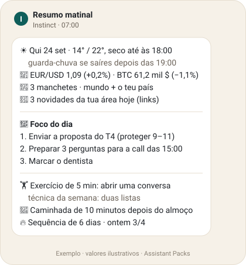
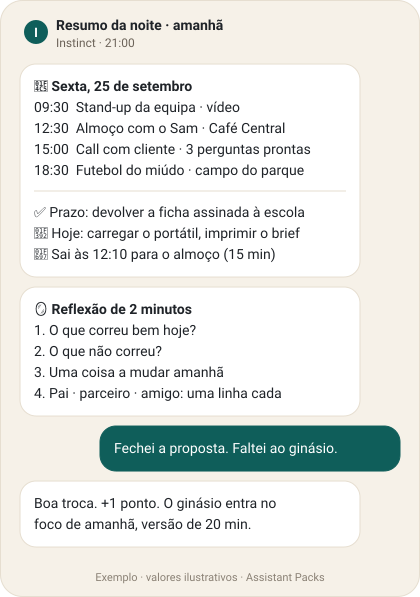
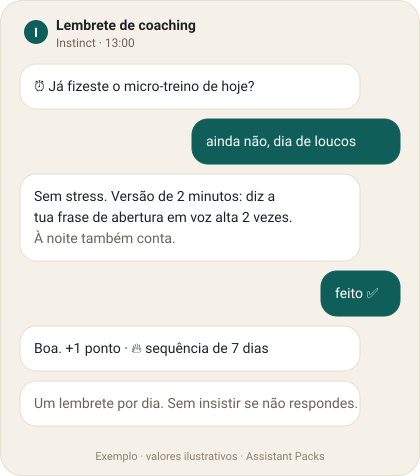
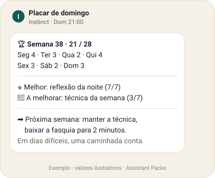

<a href="../README.pt.md">← Início</a> · <a href="README.md">English</a> · <b>Português</b>

# 🖼️ Galeria de exemplos

Como ficam os packs num chat real, e formas de os ajustar. Os valores são ilustrativos; o teu Instinct usa a tua cidade, o teu calendário e fontes ao vivo.

**Queres a tua configuração aqui?** Partilha-a em [Show & Tell](https://github.com/olserra/assistant-packs/discussions/categories/show-and-tell) ou abre um PR a acrescentá-la abaixo. Remove primeiro os detalhes pessoais.

## ☀️ Pack n.º 1 · O Assistente Configurado

<table>
  <tr>
    <th width="50%">Português</th>
    <th width="50%">English</th>
  </tr>
  <tr>
    <td> <b>Resumo da manhã</b> · 07:00 · <a href="../packs/configured-assistant/skills/configured-assistant-pt/references/resumo-matinal.md">módulo</a></td>
    <td> <b>Morning brief</b> · 07:00 · <a href="../packs/configured-assistant/skills/configured-assistant/references/morning-brief.md">module</a></td>
  </tr>
  <tr>
    <td> <b>Resumo da noite</b> · 21:00 · <a href="../packs/configured-assistant/skills/configured-assistant-pt/references/resumo-da-noite.md">módulo</a></td>
    <td> <b>Evening brief</b> · 21:00 · <a href="../packs/configured-assistant/skills/configured-assistant/references/evening-brief.md">module</a></td>
  </tr>
  <tr>
    <td> <b>Lembrete de coaching</b> · 13:00 · <a href="../packs/configured-assistant/skills/configured-assistant-pt/references/lembrete-diario.md">módulo</a></td>
    <td> <b>Coaching ping</b> · 13:00 · <a href="../packs/configured-assistant/skills/configured-assistant/references/accountability-ping.md">module</a></td>
  </tr>
  <tr>
    <td> <b>Placar de domingo</b> · <a href="../packs/configured-assistant/skills/configured-assistant-pt/references/placar-de-pontos.md">módulo</a></td>
    <td> <b>Sunday scoreboard</b> · <a href="../packs/configured-assistant/skills/configured-assistant/references/points-scoreboard.md">module</a></td>
  </tr>
</table>

**Em falta:** a pré-visualização do módulo de vigilantes. [Boa primeira issue #8](https://github.com/olserra/assistant-packs/issues/8).

## 🎛️ Receitas de ajuste

Coisas que podes dizer ao teu Instinct depois de instalar. Cada uma muda uma coisa e mantém o resto.

| Objetivo | Diz |
|----------|-----|
| Manhãs mais cedo só nos dias úteis | *"Passa o resumo da manhã para as 6:30 nos dias úteis e mantém as 8:00 ao fim de semana."* |
| Um resumo mais leve | *"Tira os mercados e as notícias da área. Mantém o tempo, as prioridades e o exercício."* |
| Tempo para correr | *"Acrescenta uma linha sobre o tempo para correr às 7:00."* |
| Modo férias | *"Pausa tudo até segunda e depois continua de onde ficámos."* |
| Dia de doença | *"Hoje sem lembrete, estou doente."* A meta do dia desce para 1 ponto. |
| Outra competência para treinar | *"Muda o exercício diário para falar em público."* |
| Só o plano da noite | *"Fica só o resumo da noite, desliga o resto."* |

## 🙋 Configurações da comunidade

*Ainda nada aqui. Sê o primeiro:* publica a tua configuração em [Show & Tell](https://github.com/olserra/assistant-packs/discussions/categories/show-and-tell) e acrescentamo-la com créditos.
