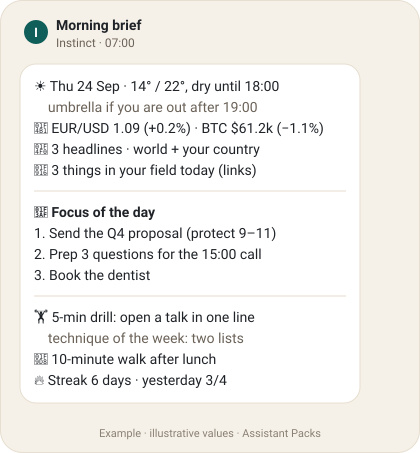
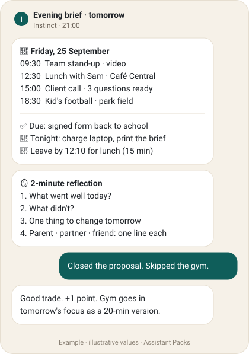
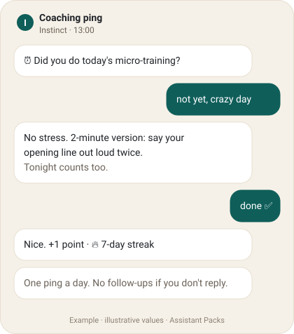
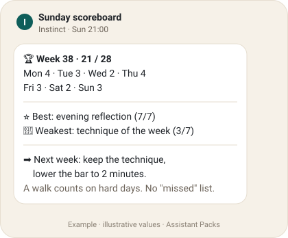

<p align="center"><a href="../../README.md">← All packs</a> · <b>English</b> · <a href="README.pt.md">Português</a> · <a href="INSTALL.md">Install</a></p>

# ☀️ Pack #1 · The Configured Assistant

<p>
  
  
  
  
  
  <a href="https://github.com/olserra/assistant-packs/issues/1"></a>
</p>

**Give your Instinct a daily rhythm: a morning brief, a plan for tomorrow every evening, one coaching ping at midday, points that forgive bad days, and watchers that speak up only when it matters.**

Based on a real daily setup, with every personal detail taken out. Your details come from a short setup interview and stay in your Instinct.

## ⚡ Install

Send this to your Instinct:

```text
Install the "Configured Assistant" pack from Assistant Packs.
Instructions: https://raw.githubusercontent.com/olserra/assistant-packs/main/packs/configured-assistant/skills/configured-assistant/SKILL.md
Modules are in the references/ folder next to it.
Run the setup interview with me, schedule only the routines I approve,
and show me a sample evening brief for tomorrow before the first one goes out.
```

Only want part of it, or setting it up in Portuguese? See [INSTALL.md](INSTALL.md).

## 👀 Previews

<table>
  <tr>
    <td width="50%"></td>
    <td width="50%"></td>
  </tr>
  <tr>
    <td></td>
    <td></td>
  </tr>
</table>

<sub>Illustrative values. Real briefs use your city, your calendar and live sources at send time.</sub>

## 🧩 The six modules

| | Module | When | What you get | Try it now |
|:-:|--------|------|--------------|------------|
| ☀️ | [Morning brief](skills/configured-assistant/references/morning-brief.md) | 07:00 | Weather and rain by part of day, your market numbers, headlines, 3 things in your field, 3 priorities, a 5-minute drill, a small wellbeing practice, your streak | *"run my morning brief"* |
| 🌙 | [Evening brief](skills/configured-assistant/references/evening-brief.md) | 21:00 | Tomorrow's agenda in time order, deadlines, what to prepare tonight, when to leave, then a 2-minute reflection | *"show me tomorrow's evening brief"* |
| ⏰ | [Coaching ping](skills/configured-assistant/references/accountability-ping.md) | 13:00 | One question: did you do today's micro-training? A 2-minute fallback if not. Never a second ping. | *"ping me like you would at lunch"* |
| 🏆 | [Points & scoreboard](skills/configured-assistant/references/points-scoreboard.md) | Daily · Sunday | Up to 4 points a day, a streak, and a Sunday board that shows what you did | *"how's my week going?"* |
| 👀 | [Watchers](skills/configured-assistant/references/event-watchers.md) | When needed | "Leave by 17:40" traffic warnings for calendar events, "they replied" alerts on threads you ask it to watch | *"tell me when Sam replies"* |
| 🎯 | [Coaching cadence](skills/configured-assistant/references/coaching-cadence.md) | Weekly · daily | A habit technique of the week, daily 5-minute practice for the skill you choose, role-play on demand | *"simulate a tough client call"* |

## 🗣️ The setup interview

Your Instinct asks these in one or two messages. Say "defaults" to skip ahead.

1. What to call you, and which language.
2. Your city for weather, and Celsius or Fahrenheit.
3. Morning and evening brief times (defaults 07:00 and 21:00).
4. Market numbers to track, if any (a currency pair, an index, a coin).
5. News regions and one topic from your field.
6. One skill to practice in small daily doses.
7. Up to three roles for the evening reflection (parent, partner, friend...). Optional.
8. Which calendars and inboxes it may read. Optional.
9. Whether you want the midday ping and the points (both on by default).

Then it sends a sample evening brief with your real data and asks "keep this format?". What you approve becomes the baseline.

## 🎛️ Make it yours

Change anything in plain words, any time:

- *"Move the morning brief to 6:30 on weekdays."*
- *"Drop the markets section, add a line on the weather for my run."*
- *"Pause everything, I'm on holiday until Monday."*
- *"No ping today, I'm sick."* (the day's target drops to 1 point)

## 🛡️ What this pack never does

- Message other people, book, buy or accept invites without your yes.
- Add extra check-ins because you missed one.
- Share your setup, calendar or reflections with anyone.

## 📄 Files

```text
pack.yaml                      metadata, modules, credits
INSTALL.md                     install messages (EN + PT)
skills/configured-assistant/   English skill + 6 module files
skills/configured-assistant-pt/ Portuguese skill + 6 module files
```

## 🙌 Credits & changelog

- **0.1.0** - first release, EN + PT. By [@olserra](https://github.com/olserra).
- Improved a module? Open a PR and add yourself to [CONTRIBUTORS.md](../../CONTRIBUTORS.md).

**Installed it?** 👍 [issue #1](https://github.com/olserra/assistant-packs/issues/1) so the counter goes up, and tell us what you changed in the comments.

<sub>Community project, not affiliated with Instinct. Using another assistant? See [ADAPTERS.md](../../ADAPTERS.md).</sub>
